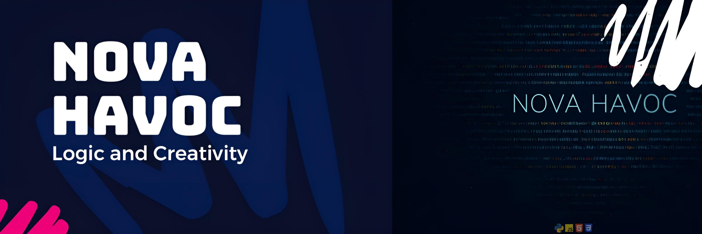

  

<h2 align="center">Hi 👋! My name is Nova and I'm a Software Engineer</h2>

###

  
  

###

  
  
  
  
  
  
  
  
  
  
  
  
  
  
  
  
  
  
  
  
  
  
  

###

###

  
  
  
  
  
  

###

 

  

